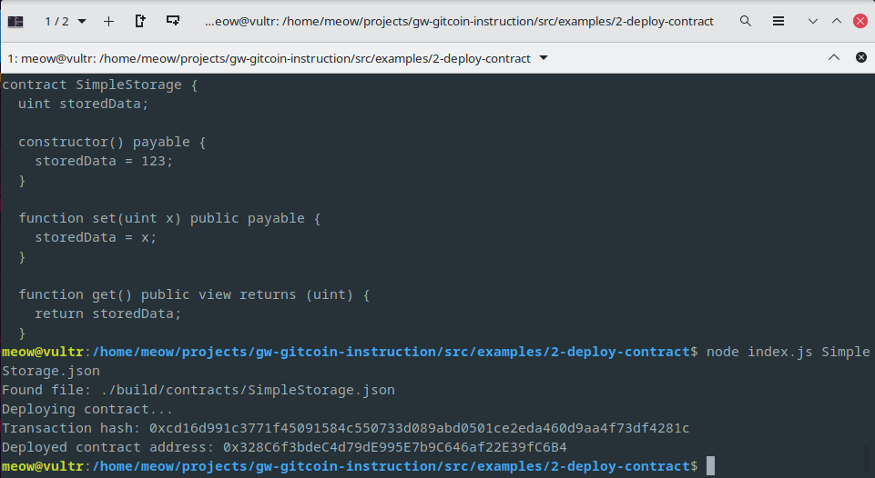

# Task 02
1. A screenshot of the console output immediately after you have successfully deployed a smart contract.
	
2. The transaction hash from the contract deployment (in text format).
	```
	0xcd16d991c3771f45091584c550733d089abd0501ce2eda460d9aa4f73df4281c
	```
3. The deployed contract address from the contract deployment (in text format).
	```
	0x328C6f3bdeC4d79dE995E7b9C646af22E39fC6B4
	```

