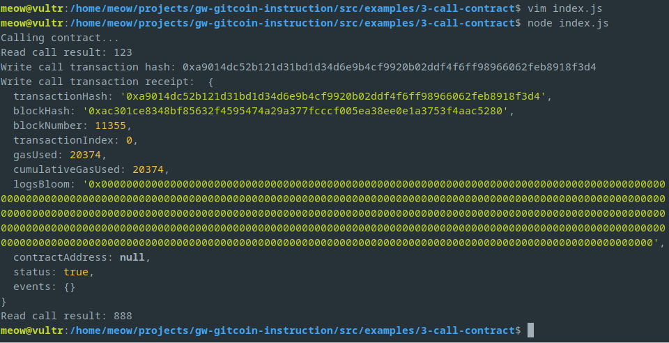

# Task 03
1. A screenshot of the console output immediately after you have successfully issued a smart contract call.
	
2. The `transaction hash` from the console output (in text format).
	```
	0xa9014dc52b121d31bd1d34d6e9b4cf9920b02ddf4f6ff98966062feb8918f3d4
	```
3. The contract address that you called (in text format).
	```
	0x328C6f3bdeC4d79dE995E7b9C646af22E39fC6B4
	```
4. The ABI for contract you made a call on (in text format).
    ```
    [
        {
            "inputs": [],
            "stateMutability": "payable",
            "type": "constructor"
        },
        {
            "inputs": [
            {
                "internalType": "uint256",
                "name": "x",
                "type": "uint256"
            }
            ],
            "name": "set",
            "outputs": [],
            "stateMutability": "payable",
            "type": "function"
        },
        {
            "inputs": [],
            "name": "get",
            "outputs": [
            {
                "internalType": "uint256",
                "name": "",
                "type": "uint256"
            }
            ],
            "stateMutability": "view",
            "type": "function"
        }
    ]
    ```
