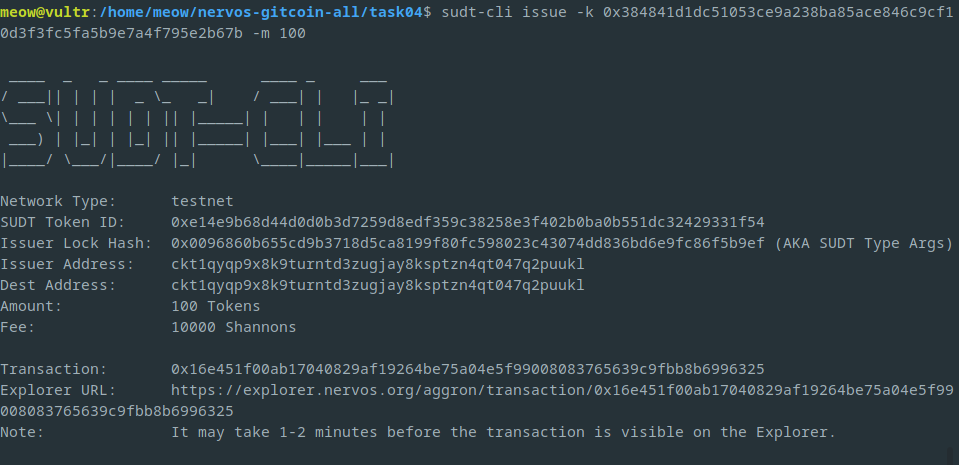
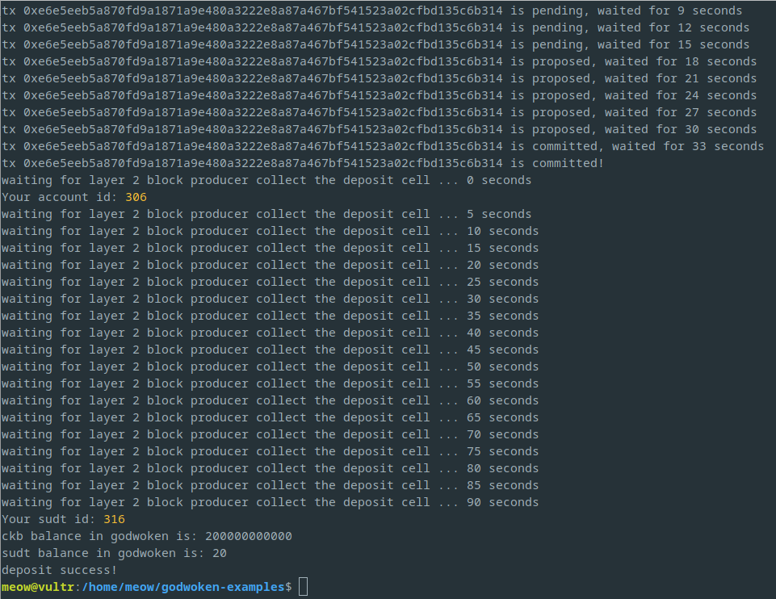

# Task 04
1. A link to the Layer 1 address you funded on the Testnet Explorer.
	- https://explorer.nervos.org/aggron/address/ckt1qyqp9x8k9turntd3zugjay8ksptzn4qt047q2puukl
2. A screenshot of the console output immediately after using `sudt-cli` to create your SUDT tokens on Layer 1.
	
3. A link to the transaction ID created by `sudt-cli` on the Testnet Explorer.
	- https://explorer.nervos.org/aggron/transaction/0x16e451f00ab17040829af19264be75a04e5f99008083765639c9fbb8b6996325
4. A screenshot of the console output immediately after you have successfully submitted a deposit to Layer 2 using the `account-cli` tool.
	
5. The SUDT ID from the console output after executing the deposit script (in text format).
	```
	316	
	```

## Full log
```
LUMOS_CONFIG_NAME: AGGRON4
current indexer data path: ./indexer-data-path/0x10639e0895502b5688a6be8cf69460d76541bfa4821629d86d62ba0aae3f9606
Indexer is syncing. Please wait.
Syncing 99.92% completed.
Syncing 99.93% completed.
Syncing 99.94% completed.
Syncing 99.95% completed.
Syncing 99.97% completed.
Syncing 99.98% completed.
Syncing 99.99% completed.
Indexer synchronized.
using eth address: 0x6486143EC7255b3C0351dFbab76efb1Fb05F5c8e
using ckb address: ckt1qyqp9x8k9turntd3zugjay8ksptzn4qt047q2puukl
Layer 2 lock script hash: 0xc1be0b894ff91804cd95fed17a58b654360d8553a088e1d488ccbdee830aa819
Your address: 0xc1be0b894ff91804cd95fed17a58b654360d8553
Layer 1 sudt script hash: 0xe14e9b68d44d0d0b3d7259d8edf359c38258e3f402b0ba0b551dc32429331f54
layer 2 sudt script: {
  code_hash: '0xb6d6a2882d3d08cea565047bfe901cb2afe0cb790ea5e1b61e0532ef237c4a02',
  hash_type: 'type',
  args: '0x4cc2e6526204ae6a2e8fcf12f7ad472f41a1606d5b9624beebd215d780809f6ae14e9b68d44d0d0b3d7259d8edf359c38258e3f402b0ba0b551dc32429331f54'
}
Layer 2 sudt script hash: 0x55255b5b38ba135895cbb51c0ed2a4217aa762b20b68bf2c6da7a09dc502cd87
↑ Using this script hash to get sudt account id ↑
txHash: 0xe6e5eeb5a870fd9a1871a9e480a3222e8a87a467bf541523a02cfbd135c6b314
--------- wait for tx deposit ----------
tx 0xe6e5eeb5a870fd9a1871a9e480a3222e8a87a467bf541523a02cfbd135c6b314 is pending, waited for 0 seconds
tx 0xe6e5eeb5a870fd9a1871a9e480a3222e8a87a467bf541523a02cfbd135c6b314 is pending, waited for 3 seconds
tx 0xe6e5eeb5a870fd9a1871a9e480a3222e8a87a467bf541523a02cfbd135c6b314 is pending, waited for 6 seconds
tx 0xe6e5eeb5a870fd9a1871a9e480a3222e8a87a467bf541523a02cfbd135c6b314 is pending, waited for 9 seconds
tx 0xe6e5eeb5a870fd9a1871a9e480a3222e8a87a467bf541523a02cfbd135c6b314 is pending, waited for 12 seconds
tx 0xe6e5eeb5a870fd9a1871a9e480a3222e8a87a467bf541523a02cfbd135c6b314 is pending, waited for 15 seconds
tx 0xe6e5eeb5a870fd9a1871a9e480a3222e8a87a467bf541523a02cfbd135c6b314 is proposed, waited for 18 seconds
tx 0xe6e5eeb5a870fd9a1871a9e480a3222e8a87a467bf541523a02cfbd135c6b314 is proposed, waited for 21 seconds
tx 0xe6e5eeb5a870fd9a1871a9e480a3222e8a87a467bf541523a02cfbd135c6b314 is proposed, waited for 24 seconds
tx 0xe6e5eeb5a870fd9a1871a9e480a3222e8a87a467bf541523a02cfbd135c6b314 is proposed, waited for 27 seconds
tx 0xe6e5eeb5a870fd9a1871a9e480a3222e8a87a467bf541523a02cfbd135c6b314 is proposed, waited for 30 seconds
tx 0xe6e5eeb5a870fd9a1871a9e480a3222e8a87a467bf541523a02cfbd135c6b314 is committed, waited for 33 seconds
tx 0xe6e5eeb5a870fd9a1871a9e480a3222e8a87a467bf541523a02cfbd135c6b314 is committed!
waiting for layer 2 block producer collect the deposit cell ... 0 seconds
Your account id: 306
waiting for layer 2 block producer collect the deposit cell ... 5 seconds
waiting for layer 2 block producer collect the deposit cell ... 10 seconds
waiting for layer 2 block producer collect the deposit cell ... 15 seconds
waiting for layer 2 block producer collect the deposit cell ... 20 seconds
waiting for layer 2 block producer collect the deposit cell ... 25 seconds
waiting for layer 2 block producer collect the deposit cell ... 30 seconds
waiting for layer 2 block producer collect the deposit cell ... 35 seconds
waiting for layer 2 block producer collect the deposit cell ... 40 seconds
waiting for layer 2 block producer collect the deposit cell ... 45 seconds
waiting for layer 2 block producer collect the deposit cell ... 50 seconds
waiting for layer 2 block producer collect the deposit cell ... 55 seconds
waiting for layer 2 block producer collect the deposit cell ... 60 seconds
waiting for layer 2 block producer collect the deposit cell ... 65 seconds
waiting for layer 2 block producer collect the deposit cell ... 70 seconds
waiting for layer 2 block producer collect the deposit cell ... 75 seconds
waiting for layer 2 block producer collect the deposit cell ... 80 seconds
waiting for layer 2 block producer collect the deposit cell ... 85 seconds
waiting for layer 2 block producer collect the deposit cell ... 90 seconds
Your sudt id: 316
ckb balance in godwoken is: 200000000000
sudt balance in godwoken is: 20
deposit success!
```
