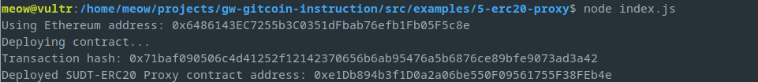
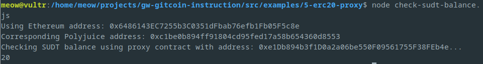

# Task 05
1. A screenshot of the console output immediately after deploying smart contract.
	
2. The address of the ERC20 Proxy Contract you deployed (in text format).
	```
	0xe1Db894b3f1D0a2a06be550F09561755F38FEb4e
	```
3. A screenshot of the console output immediately after checking your SUDT balance.
	
4. The Ethereum address that was checked (in text format).
	```
	0x6486143EC7255b3C0351dFbab76efb1Fb05F5c8e
	```
