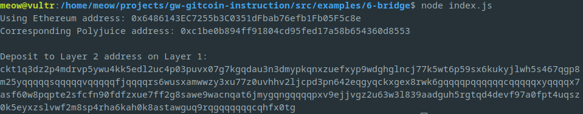

# Task 06
1. A screenshot of the console output immediately after you have successfully generated your Deposit Receiver Address.
	
2. Your Deposit Receiver Address (in text format).
	```
	ckt1q3dz2p4mdrvp5ywu4kk5edl2uc4p03puvx07g7kgqdau3n3dmypkqnxzuefxyp9wdghglncj77k5wt6p59sx6kukyjlwh5s467qgp8m25yqqqqqsqqqqqvqqqqqfjqqqqrs6wusxamwwzy3xu77z0uvhhv2ljcpd3pn642eqgyqckxgex8rwk6gqqqqpqqqqqqcqqqqqxyqqqqx7asf60w8pqpte2sfcfn90fdfzxue7ff2g8sawe9wacnqat6jmygqngqqqqpxv9ejjvgz2u63w3l839aadguh5rgtqd4devf97a0fpt4uqsz0k5eyxzslvwf2m8sp4rha6kah0k8astawguq9rqgqqqqqqcqhfx0tg
	```
3. The Ethereum address used to generate the Deposit Receiver Address (in text format).
	```
	0x6486143EC7255b3C0351dFbab76efb1Fb05F5c8e
	```
4. A link to the Etherscan explorer for the successful Force Bridge transaction. This can be found on Force Bridge under History→Succeed.
	- https://rinkeby.etherscan.io/tx/0x6136bae2c578003b59a0bbd8eabe01d04fcf923b1f0e222644e3211927d73dd5
5. A link to the Nervos explorer for the successful Force bridge transaction. This can be found on Force Bridge under History→Succeed.
	- https://explorer.nervos.org/aggron/transaction/0x37a3827ae88590dbc655ddfc52cb2be23c3cd7f7ea63b52c7d0cbdbf45d6bc44
