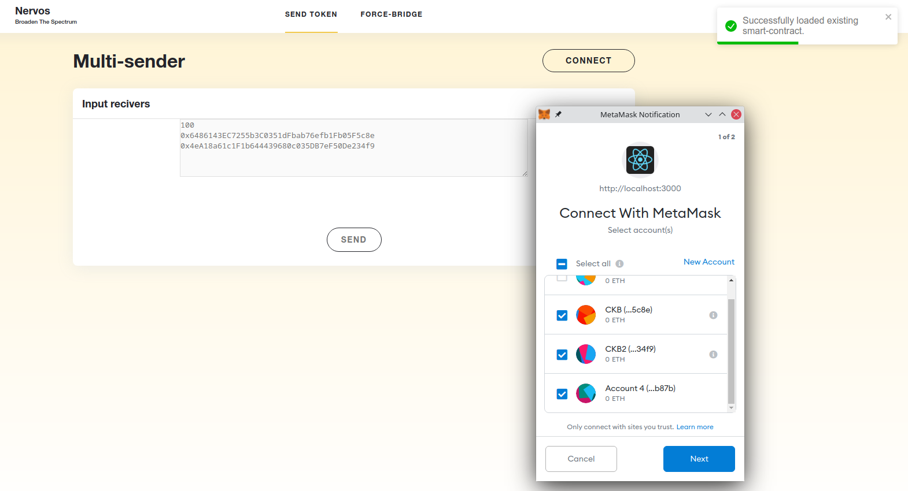
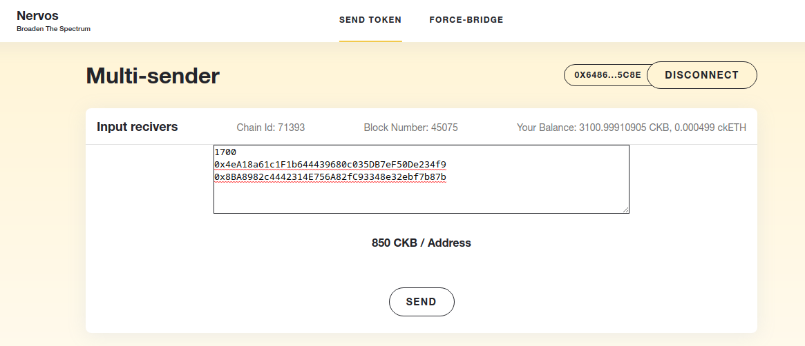
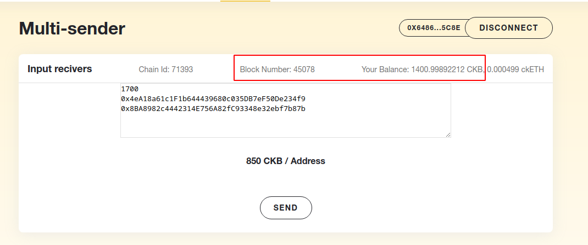
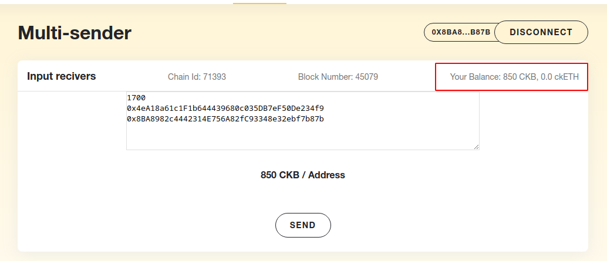

1. Screenshots or video of your application running on Godwoken.
	- Step 1.
		```bash
		yarn && yarn build && yarn start
		```
	- Step 2. Open `http://localhost:3000` and connect your wallet
		
	- Step 3. Input amount and receiver's address. ETH address will be automatically converted to polyjuice address.
		
	- Step 4. Send and wait for your balance to decreased
		
	- Step 5. Check balance
		
	- Demo
		- https://vimeo.com/594266588

2. Link to the GitHub repository with your application which has been ported to Godwoken. This must be a different application than the one covered in this guide.
	- https://github.com/7h2x5e/nervos-gitcoin-task07

3. If you deployed any smart contracts as part of this tutorial, please provide the transaction hash of the deployment transaction, the deployed contract address, and the ABI of the deployed smart contract. (Provide all in text format.)
	- Transaction hash
		```
		0x0f6f154d140fc48e1000823c521b75807d57432d4c3c962fffb94b76fa9ce611
		```
	- Deployed contract address
		```
		0x6e20280512D096592CbECeB6928D487bCE1926BE
		```
	- ABI
		```
		[
		  {
		    "inputs": [],
		    "stateMutability": "payable",
		    "type": "constructor"
		  },
		  {
		    "anonymous": false,
		    "inputs": [
		      {
			"indexed": false,
			"internalType": "address",
			"name": "sender",
			"type": "address"
		      },
		      {
			"indexed": false,
			"internalType": "uint256",
			"name": "value",
			"type": "uint256"
		      }
		    ],
		    "name": "TransferCompleted",
		    "type": "event"
		  },
		  {
		    "inputs": [],
		    "name": "owner",
		    "outputs": [
		      {
			"internalType": "address",
			"name": "",
			"type": "address"
		      }
		    ],
		    "stateMutability": "view",
		    "type": "function"
		  },
		  {
		    "inputs": [
		      {
			"internalType": "address[]",
			"name": "to",
			"type": "address[]"
		      }
		    ],
		    "name": "multisend",
		    "outputs": [],
		    "stateMutability": "payable",
		    "type": "function"
		  }
		]
		```
