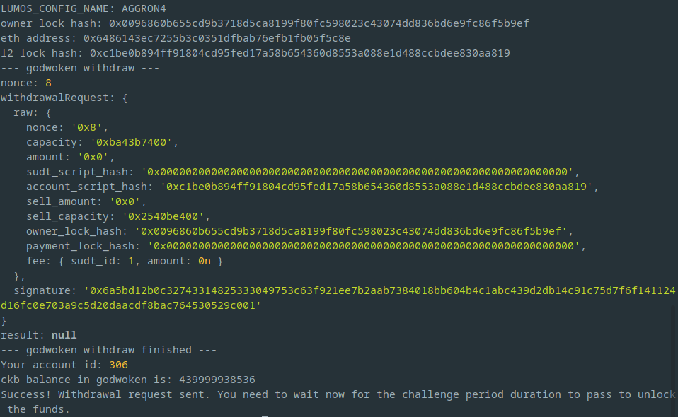

# Task 09
1. A screenshot of the console output immediately after running the `withdraw` command.
	
2. The Ethereum address that you've used for your Layer 2 account (in text format).
	```
	0x6486143EC7255b3C0351dFbab76efb1Fb05F5c8e
	```
3. The Nervos Layer 1 address that you passed to `withdraw` command (in text format).
	```
	ckt1qyqp9x8k9turntd3zugjay8ksptzn4qt047q2puukl
	```
