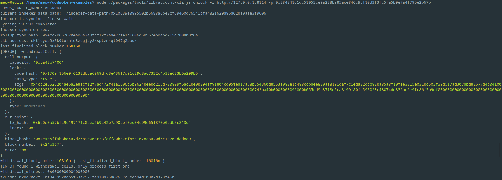
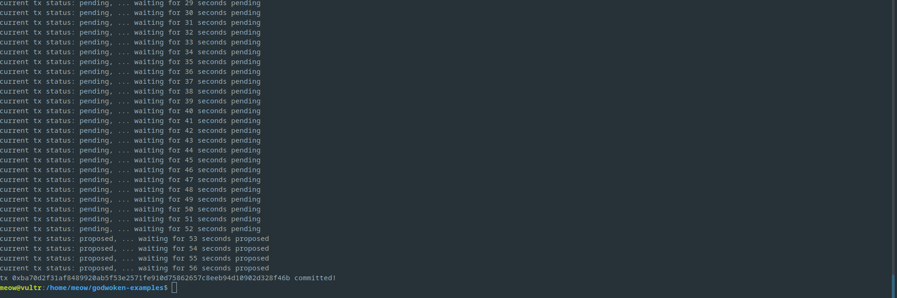

# Task 10
1. A screenshot of the console output immediately after running the "unlock" command.
	
	
	
2. The Ethereum address that you've used for your Layer 2 account (in text format).
	```
	0x6486143EC7255b3C0351dFbab76efb1Fb05F5c8e
	```
3. The Nervos Layer 1 address associated with the private key passed to "unlock" command (in text format). This is "ckb address" in the console output.
	```
	ckt1qyqp9x8k9turntd3zugjay8ksptzn4qt047q2puukl
	```
