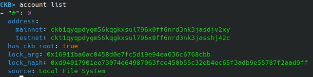
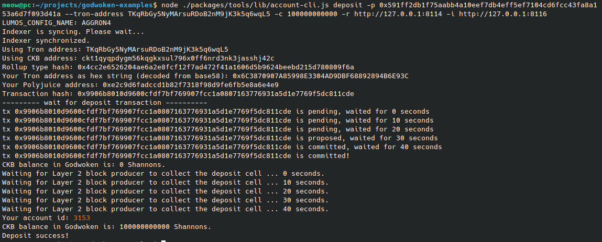
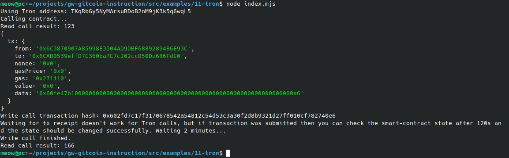

# Task 11
1. A screenshot of the accounts you created (account list) in ckb-cli.
	
2. A link to the Layer 1 address you funded on the Testnet Explorer.
	- https://explorer.nervos.org/aggron/address/ckt1qyqpdygm56kqgkxsul796x0ff6nrd3nk3jasshj42c
3. A screenshot of the console output immediately after you have successfully submitted a CKByte deposit to your Tron account on Layer 2.
	
4. A screenshot of the console output immediately after you have successfully issued a smart contract calls on Layer 2.
	
5. The transaction hash of the "Contract call" from the console output (in text format).
	```
	0x602fd7c17f3170678542a54812c54d53c3a30f2d8b9321d27ff010cf782740e6
	```
6. The contract address that you called (in text format).
	```
	0x6CAB0539effD7E360ba7E7c202ccB50Da686FdE0
	```
7. The ABI for contract you made a call on (in text format).
	```
	[
	  {
	    "inputs": [],
	    "stateMutability": "payable",
	    "type": "constructor"
	  },
	  {
	    "inputs": [
	      {
		"internalType": "uint256",
		"name": "x",
		"type": "uint256"
	      }
	    ],
	    "name": "set",
	    "outputs": [],
	    "stateMutability": "payable",
	    "type": "function"
	  },
	  {
	    "inputs": [],
	    "name": "get",
	    "outputs": [
	      {
		"internalType": "uint256",
		"name": "",
		"type": "uint256"
	      }
	    ],
	    "stateMutability": "view",
	    "type": "function"
	  }
	]
	```
8. Your Tron address (in text format).
	```
	TKqRbGy5NyMArsuRDoB2nM9jK3k5q6wqL5
	```
